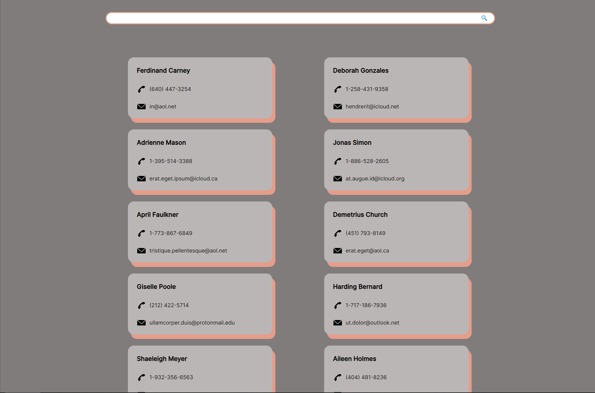

### Адресная книга с поиском коллег по имени

Маленькое тестовое задание, найденное в одном из тг каналов - использовалось для первых опытов с TypeScript.

Для использования необходимо из папки **address-book-backend** запустить сервер командой `npm start`, клиентская часть запускается из основной папки командой `npm start`

